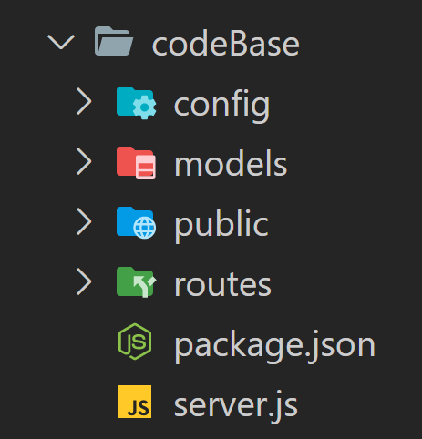
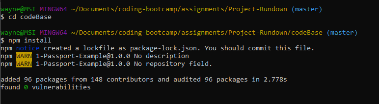
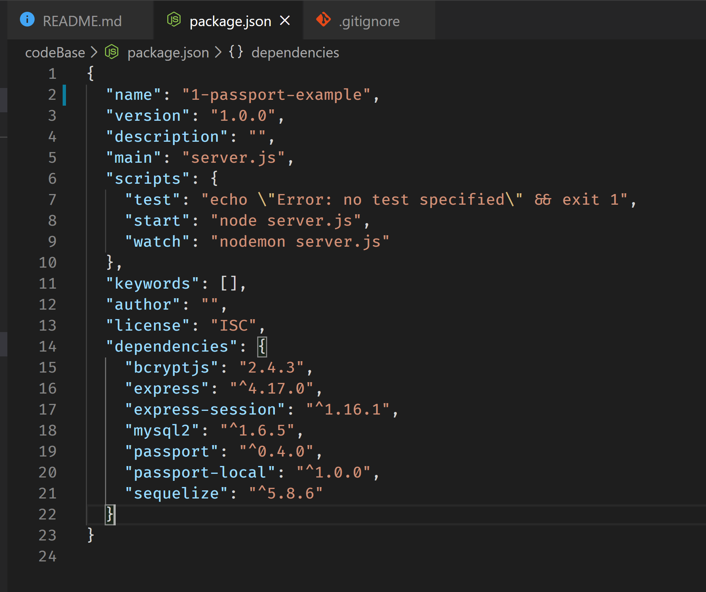
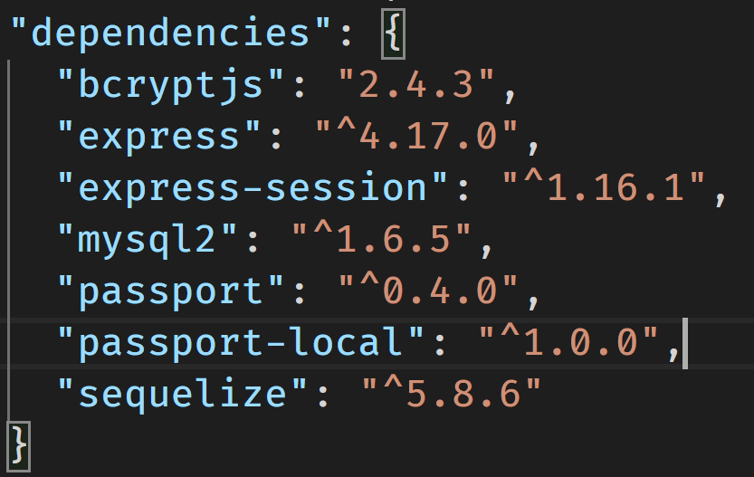

# Project-Rundown
BoilerPlate code saves you from writing repeated but necessary code in your project files.
A boilerPlate codeBase kickstarts a dev-project by not having to think about or set-up necessary dependencies and file structures. This allows you to think about the problem at hand and get started on wiritng unique code for your app.

## The Rundown
In this repo, we have the start of a boilerPlate codebase anyone can use in their next project.

Let's go through each file and flesh out how this codebase works.

### Installation
* Go ahead and clone this repo. Using your git flavoured terminal.
    I'm using git-bash as I'm a dirty windows user.

    Find a place you want to house all these files in your machine and run:
    ``` git clone git@github.com:wannabewayno/Project-Rundown.git ```

    You can copy the git link from the repo page as shown below
    

* From here on, everything will be explained using the codeBase folder as the root directory
    Go ahead and move into this folder (in git bash) ``` cd codebase ```
* We should have a folder structure that looks like 
   


* First off, we see a file called package.json. This is a sort of configuration file for npm that installs and keeps track of 3rd party dependencies used in the codeBase.
* Let's go ahead and install all necessary dependencies that this codebase relies on by running
 ``` npm install ```.
* This will automatically look for a package.json file and install all dependencies listed under the 'dependencies' key 
* Here's an example of running npm install on my machine
  


### Dependencies
Now that we have the repo cloned and all of our dependencies installed,
What are these dependencies?

A good starting point in understanding a codeBase is to first check the package.json. This will give some insight to the intention of the code's function as these dependencies are required for the code's function. 


#### package.json


##### scripts

Scripts are called by running ```npm <script name>``` and they execute associated text as script through npm.
  * "test" we see that no tests are specified
  * "start" this will run ```node server.js``` which will run server.js through node
  * "watch" will run ```nodemon server.js``` which will run server.js through nodemon (if installed)
    * nodemon is a 3rd party dependency that is used during developement to restart a server if any changes to the file running the server occur. nodemon is not listed as a dependency for this project (most devs will have this installed globally on their machine as standard, like myself)
    * usually this this listed a dev-dependency, but in-case it is omitted. You can learn more about nodemon here -> <a href="https://www.npmjs.com/package/nodemon">nodemon</a> 


##### "dependencies"
 

Here we see the all the dependencies that package.json installed when we ran ```npm install```

##### bcryptjs

##### express

##### express-session

##### mysql2

##### passport

##### passport-local

##### seqeulize

#### npm start
 Remember that npm start script earlier? "start" is usually attributed to executing the main function of a codeBase. This will have assocaited with it a list of code to be run through node that will run the application it was coded for. 

 So the next best thing is to run the code and see what it's doing so that when we peek under the hood, we'll have a better idea of it's intention.

 running npm start we end up this....
 

 An error...

 Looking at the error however, we can see in the first line that this seems to be a connection problem using sequelize. Sequelize as define <a href="/sequalize">above</a> is an npm package used to query an SQL database. 

 The parameters for connecting to a database through sequelize is found in the configuration file. 

 ### config 
 
 The configuration file is usually found in the root directory and handles all connection requirements for a database (if the app is connecting to a database).

 Here we see a two files: "config.json", "passport.js" and a directory: middleware.

 At the moment our connection issues are most likely coming from the config.json file not being properly 'wait for it'.... configured for our database. 

 ##### config.json
 
 The configuration file handles all the information required to connect to a database.
 here, we see that all password fields are set to null.
 The username is generic.

 The keys "development","test" and "production" refer to different configurations of the database required for the purpose in mind.
 
* ###### "production" 
  * will the configuration information used when the app is deployed and live. 

* ###### "test"
 * Will be the database you might use to perfrom testing and you might have specific data seeded in the database for testing out particular cases of your codebase.

* ###### "development" 
  * Is the database configuration used when developing the code and performing manual testing.

The closest context to our situation at the moment is development. For the purpose of this walk through, i've modified the data under the "development" key in config.json to connect to a dummy database on my machine.

Here is what is looks like


Let's try ```npm start again```


> This seemed to do the trick.

We can see that:
* In our database "passport_demo" (that I have created in MySQL for context). Is now being populated with a table called Users that contains columns (id,email,password,createdAt,updatedAt).
* there is a server being set up PORT 8080; we can access is through http://localhost:8080 in our browser.

Let's go ahead and see what this app is trying to do.

##### Opening the app through the browser

Now that we have run ```npm start``` successfully (by setting up the config.json file)

we can go to the browser of your choice (for me, chrome) and type in 
* http://localhost:8080

this should get you here.


##### What's happening?
```npm start``` is running our server.js file which uses express to set up a server and handle queries from the browser. 
By filling in the configuration file correctly, sequelize is making a connection our database, not throwing an error and not causing the server.js file to crash.

Hence we're now seeing the root route "/"


What we're seeing is a html file being sent to the browser when we hit the default route "/".
The route "/" is the forward slash at the end of http://localhost:8080/

#### passport.js


