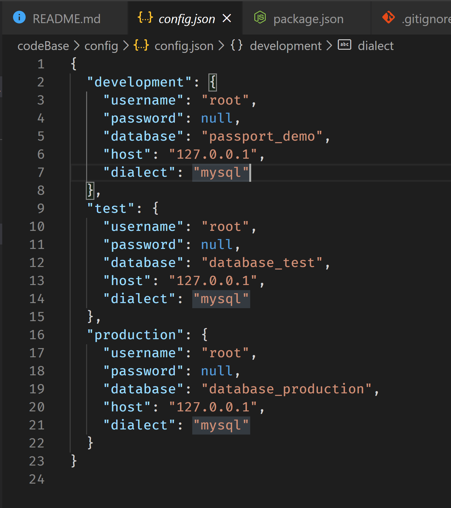

# Project-Rundown
BoilerPlate code saves you from writing repeated but necessary code in your project files.
A boilerPlate codeBase kickstarts a dev-project by not having to think about or set-up necessary dependencies and file structures. This allows you to think about the problem at hand and get started on wiritng unique code for your app.

## The Rundown
In this repo, we have the start of a boilerPlate codebase anyone can use in their next project.

Let's go through each file and flesh out how this codebase works.


* <a href="#installation">Installation</a>

* <a href="#Dependencies">Dependencies</a>

* <a href="#config">config</a>
    * <a href="#config.json">config.json</a>
    * <a href="#passport.js">passport.js</a>
    * <a href="#isAuthenticate.js">isAuthenticate.js</a>
* <a href="#server.js">server.js</a>
  


## Installation
* Go ahead and clone this repo. Using your git flavoured terminal.
    I'm using git-bash as I'm a dirty windows user.

    Find a place you want to house all these files in your machine and run:
    ``` git clone git@github.com:wannabewayno/Project-Rundown.git ```

    You can copy the git link from the repo page as shown below

    

* From here on, everything will be explained using the codeBase folder as the root directory
    Go ahead and move into this folder (in git bash) ``` cd codebase ```
* We should have a folder structure that looks like 
   


* First off, we see a file called package.json. This is a sort of configuration file for npm that installs and keeps track of 3rd party dependencies used in the codeBase.
* Let's go ahead and install all necessary dependencies that this codebase relies on by running
 ``` npm install ```.
* This will automatically look for a package.json file and install all dependencies listed under the 'dependencies' key 
* Here's an example of running npm install on my machine
  


## Dependencies
Now that we have the repo cloned and all of our dependencies installed,
What are these dependencies?

A good starting point in understanding a codeBase is to first check the package.json. This will give some insight to the intention of the code's function as these dependencies are required for the code's function. 


### package.json


#### scripts

Scripts are called by running ```npm <script name>``` and they execute associated text as script through npm.
  * "test" we see that no tests are specified
  * "start" this will run ```node server.js``` which will run server.js through node
  * "watch" will run ```nodemon server.js``` which will run server.js through nodemon (if installed)
    * nodemon is a 3rd party dependency that is used during developement to restart a server if any changes to server.js occur.
    * nodemon is not listed as a dependency for this project (most devs will have this installed globally on their machine as standard, like myself)
    * usually this is listed as a dev-dependency, but in-case it is omitted. You can learn more about nodemon here -> <a href="https://www.npmjs.com/package/nodemon">nodemon</a> 


#### "dependencies"
 

Here we see the all the dependencies that package.json installed when we run ```npm install```

#### bcryptjs
<a href="https://www.npmjs.com/package/nodemon">bcryptjs</a> is a password hashing library.
It uses the bcrypt hashing algorithm to securely store a password as a hash not not plain text.
bcrypt goes further by also adding a salt: a randomly generated number at the end of your password and then hashing the result. This ensures that the same password will not have the same hash, making every hash truly unique

For example:
|password|salt|result|hash|
|--------|----|------|----|
|mypassword1|E1F53135E559C253|mypassword1E1F53135E559C253|$2y$12$dlvzItJZVQ0cuJCPdVQ7TuyhsdVv5V77FZW.3wCIm/pagxMbwxOY.
|mypassword1|84B03D034B409D4E|mypassword184B03D034B409D4E|$2y$12$44MEiq0mDr6gA2gp/VxDY.DadEeCSlJh4pmEDvE0aagVTs.wIOTq.


This is more secure as if any password information were compromised and read directly off the database, the password information would be a hash, and not the 'plain text' password. A hash is not backwards compatible and hence a password cannont be derived from the hash.
The hash is stored as a reference and upon entering the right password a hash is generated and checked against the reference hash. If they're a match authentication is granted.

#### express
<a href="https://www.npmjs.com/package/express">Express</a>
is a web server framework package that builds upon the standard http package in node.
It's considered a standard for web applications built from node. Express simplifies the process of coding and customising a server for your application  

#### express-session
<a href="https://www.npmjs.com/package/express-session">express-session</a> is a middleware package designed to work with express to set up a 'session'. Sessions store user data after authentication and determines the 'state' of the app at any point in time. 

Basically this allows an application to remember what the user is doing and act accordingly.


#### mysql2
<a href="https://www.npmjs.com/package/mysql2">mysql2</a> is a library that allows one to connect to a MySQL database. In this context, mysql2 is used in conjunction with sequelize to connect to a MySQL database. 

#### passport
<a href="https://www.npmjs.com/package/passport">passport</a> handles the authentication process of a user session. It's designed to work with express. Passport is a validation suite for authenticating requests to a database. It does so by providing configurable tools known as 'strategies' that you can set up to authenticate a database request.

#### passport-local
<a href="https://www.npmjs.com/package/passport-local">passport-local</a> is a strategy used by passport to authenticate username and password requests from a database

#### sequelize
<a href="https://www.npmjs.com/package/sequelize">sequelize</a> is an ORM that produces data models for your application and allows you to interact with a MySQL server more naturally. It uses prepared statements to turn queries into SQL syntax and talk with the SQL servers to send and recieve data.

### npm start
 Remember that npm start script earlier? "start" is usually attributed to executing the main function of a codeBase. This will have associated with it a list of code to be run through node.
  * This code will run the application it was coded for. 

 So the next best thing is to run the code and see what it's doing so that when we peek under the hood, we'll have a better idea of it's intention.

 running npm start we end up this....

 

 An error...

 Looking at the error however, we can see in the first line that this seems to be a connection problem using sequelize. Sequelize as defined <a href="#sequelize">above</a> is an npm package used to query an SQL database. 

 The parameters for connecting to a database through sequelize is found in the configuration file. 

 ## config 
 
 The configuration file is usually found in the root directory and handles all connection requirements for a database (if the app is connecting to a database).

 Here we see a two files: "config.json", "passport.js" and a directory: middleware.

 At the moment our connection issues are most likely coming from the config.json file not being properly
 
 'wait for it'.... 
 
 configured for our database. 

 ### config.json
 
 The configuration file handles all the information required to connect to a database.
 here, we see that all password fields are set to null.
 The username is generic.

 The keys "development","test" and "production" refer to different configurations of the database required for the purpose in mind.
 
##### "production" 
  * The configuration information used when the app is deployed and live. 

##### "test"
 * Will be the database you might use to perfrom testing and you might have specific data seeded in the database for testing out particular cases of your codebase.

##### "development" 
  * Configuration used when developing the code and performing manual testing.

The closest context to our situation at the moment is development. For the purpose of this walk through, i've modified the data under the "development" key in config.json to connect to a dummy database on my machine.

Here is what is looks like


Let's try ```npm start again```


> #####  This seemed to do the trick.

We can see that:
* In our database "passport_demo" (that I have created in MySQL for context). Is now being populated with a table called 'Users' that contains columns (id,email,password,createdAt,updatedAt).
* there is a server being set up PORT 8080; we can access is through http://localhost:8080 in our browser.

Let's go ahead and see what this app is trying to do.

#### Opening the app through the browser

Now that we have run ```npm start``` successfully (by setting up the config.json file)
we can go to the browser of your choice (for me, chrome) and type in 

> <a href="http://localhost:8080">http://localhost:8080</a>

#### What's happening?
```npm start``` is running our server.js file which uses express to set up a server and handle queries from the browser. 
By filling in the configuration file correctly, sequelize is making a connection to our database, not throwing an error and not causing the server.js file to crash.

Hence we're now seeing the root route "/"


This is a html file being sent to the browser when we hit the default route "/".
The route "/" is the forward slash at the end of http://localhost:8080/


### passport.js
Passport.js is a file that configures the <a href="#passport">passport</a> package to provide authentication for our specific 'User' model

> This file is well commented, we will outline it's function here. For more detail. Open the file and have a look at the added comments

First off, we require the passport package to use it, then we require the <a href="#passport-local">passport-local</a> package as 1 of many authentication strategies used for passport.


The strategy we're using currently is designed specifically for authenticating usernames and passwords from a database object.

In order to authenticate this database object we need to require our database model
as shown in line 11


Now that we have passport, it's authentication strategy and our database model.
We can configure passport to authenticate our database model.

#### To do this:
* we need to define an authentication strategy
* we tell passport to use this authentication strategy

##### defining an authentication strategy

We create a new strategy by invoking ``` new Strategy(options,verify) ```

in our case, our strategy is defined by LocalStrategy (as we required it as such);


* ###### options
    * 
  
        Since this strategy is for verifying usernames and passwords, we are telling it that our usernameField will be referenced by "email" in our database

* ###### verify
    * 
  
        The verify parameter is a function that will do the verification
        for passport-local this strategy will pass in a username and password to the verification function. 
        We have already defined the username to be an email. and hence we will perform verification with these inputs
    * 1.) We query our database to find a user that with the email that was provided
    * 2.) recieve the result of our query
    * 3.) check to see if the result returned a user (dbUser).
        * PASS: move onto the next check
        * FAIL: return a message saying "Incorrect email" (user not found from our query)
    * 4.) if the result returned a user then check that the supplied password matches the stored password (in dbUser)
        * PASS: Move onto the next check
        * FAIL: Return a message saying "Incorrect password" (pass word doesn't match)
    * 5.) If all checks pass, return the dbUser object (Authenticated)
  
##### Tell passport to use this authentication strategy

Once we have defined our strategy, we can tell passport to use this simply by invoking

``` passport.use(Strategy)```

In our example, we can see we are telling passport to use our defined strategy and defining it all in the one instance.


#### Other configuration Options for Passport

Passport will store authenticated information under req.user in the request object as it traverses the middleware stack (more on that in <a href="#server.js">server.js</a>).

However, in order for passport to store information and still have the ability to use custom methods we have defined for our 'User' model. We will need to configure this for passport too.

below we have defined how passport serializes the information

##### Serialization

When we store information in a database or elsewhere, usually this will lose the class properties that the object may have attributed to it. In this case, we tell passport how to serialize the 'User' object and how to de-serialize the 'User' object back into it's class instance to re-attach custom methods and properties we have defined for it.

this included the verifyPassword method defined in the verification function used above


### isAuthenticate.js 


Next the last thing in the configuration file is the isAuthenticate.js file under the middleware folder.

This is a simple function and I'll outline it's use here. For a complete walk through, have a look at the file's comments.

This is a function that will return the user to the "/" default route (that homepage we saw earlier) if the user isn't authenticated to access a particular route.

Let's bring it up for reference. 


This function is being used as custom middleware for our app.
Basically, we can use this as a gatekeeper for any route we want authorised access to.

with passport.js, after it authenticates a user, it places the user in the requst object.
With this function acting as middleware before a route it will check for a user:

It does this on line 25, by calling req.user.

* If req.user is defined then we return next()
   Which is an internal Express function that tells the router to continue to the next route. The next route will be the route we wanted authentication for.
* if req.user is undefined then we return a redirect.
    The re-direct will skip over any other route and return the user back to the deafult route "/", which is the homepage

### server.js


Ok, so we have installed all necessary dependencies, updated the configuration files and configured passport in passport.js

We have also seen the app running by calling ```npm start```, which as I mentioned earlier actually runs
```node server.js```, the file in question.

server.js is the backbone of this application, it's what makes this app dynamic and server.js acts as the base to send and receive http responses and requests respectively.


