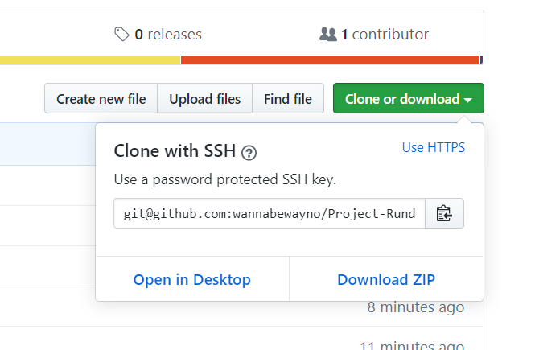

# Project-Rundown
BoilerPlate code saves you from writing repeated but necessary code in your project files.
A boilerPlate codeBase kickstarts a dev-project by not having to think about or set-up necessary dependenies and file structures. This allows you think about the problem at hand and get started on wiritng unique code for your app.

## The Rundown
In this repo, we have the start of a boilerPlate codebase anyone can you in their next project.

Let's go through each file and flesh out how this codebase works.

### Installation
Go ahead and clone this repo. Using your git flavoured terminal.
I'm using git-bash as I'm a dirty windows user.

Find a place you want to house all these files in your machine and run:
``` git clone git@github.com:wannabewayno/Project-Rundown.git ``` 
You can copy the git link from the repo page here
  
